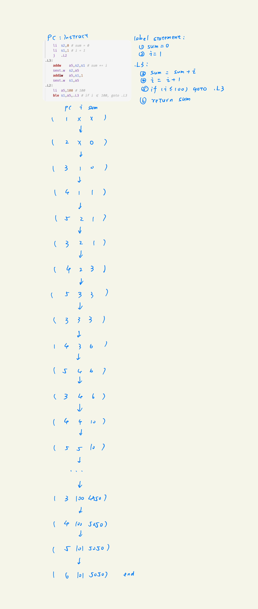

# report

## 程序是个状态机

## 理解基础设施

我们通过一些简单的计算来体会简易调试器的作用。作如下假设：

- 需要编译 500 次 NEMU 才能完成 PA
- 这 500 次编译中有 90% 用于调试
- 仅使用 GDB：每次调试中，从 GDB 获取并分析一条信息需要 30 秒；排除一个 bug 需要获取并分析 20 条信息
- 使用简易调试器：获取并分析相同信息只需要 10 秒；其余假设不变

### 仅使用 GDB 的调试时间

- 调试次数：$500 \times 90\% = 450$ 次
- 每个 bug 需要分析的信息数：20 条
- 每条信息耗时：30 秒

因此每次排除 bug 的耗时为：

$$
20 \times 30 = 600 \text{ 秒} = 10 \text{ 分钟}
$$

整个学期在调试上花费的总时间为：

$$
450 \times 600 = 270000 \text{ 秒}
= 4500 \text{ 分钟}
= 75 \text{ 小时}
$$

- 结论：仅用 GDB 调试约需 75 小时。

### 使用简易调试器的调试时间

- 每条信息耗时：10 秒

每次排除 bug 的耗时为：

$$
20 \times 10 = 200 \text{ 秒}
= 3 \text{ 分 } 20 \text{ 秒}
$$

整个学期在调试上花费的总时间为：

$$
450 \times 200 = 90000 \text{ 秒}
= 1500 \text{ 分钟}
= 25 \text{ 小时}
$$

- 结论：使用简易调试器调试约需 25 小时。

### 节省时间

$$
75 - 25 = 50 \text{ 小时}
= 3000 \text{ 分钟}
$$

- 结论：简易调试器可节省约 50 小时的调试时间。

## read the friendly manual

### riscv32 有哪几种指令

- 基础的有: R, I, S, B, U, J
- PA2 中还需要实现: M
- PA3, PA4 还需要实现: 特权级指令

### LUI 指令的行为是什么

### mstatus 结构

## shell 命令

与框架代码相比:

1. 我写了 flex 的词法分析器 与 bison 的文法分析器
2. 我在 sdb 中添加了几条命令
3. 我写了 watchpoint

我的分支管理有些乱, 我有些不好的习惯, 比方说我可能会把重构 amend 到之前的某次 commit 里面(我不该这样做, 我以后会避免的).
因为我的 amend 的问题, 导致 ysyx-tracer 出现了问题, 就是没法记录我最近的内容, 然后我就尝试了一些修复, 导致我现在 commit tree 看起来有些奇怪.
我以后不会再这样了.

我会使用 lazygit 进行 git 的操作, 这非常的丝滑, 但是我还不太会用他的 merge 和 rebase 功能.

我会使用 cloc, 这是一个用 perl 写的脚本. 我会用 cloc 来统计我写的代码.

## read the friendly manual

- `-Wall` 启用所有的 warning, 比方说 unused variable
- `-Werror` 将 warning 转换成 error

这两个是编译器"免费的午餐", 他能一定程度的把潜在的错误暴露出来并且直接编译不通过
